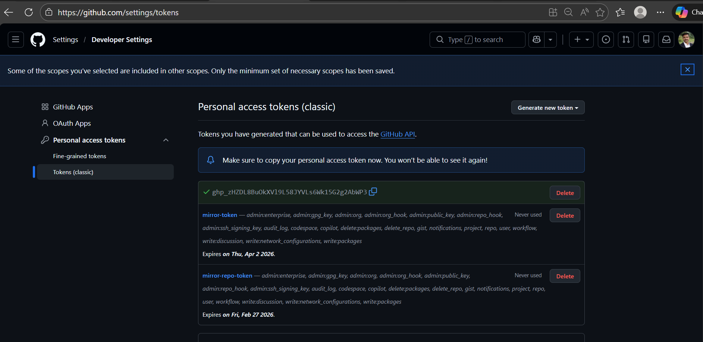
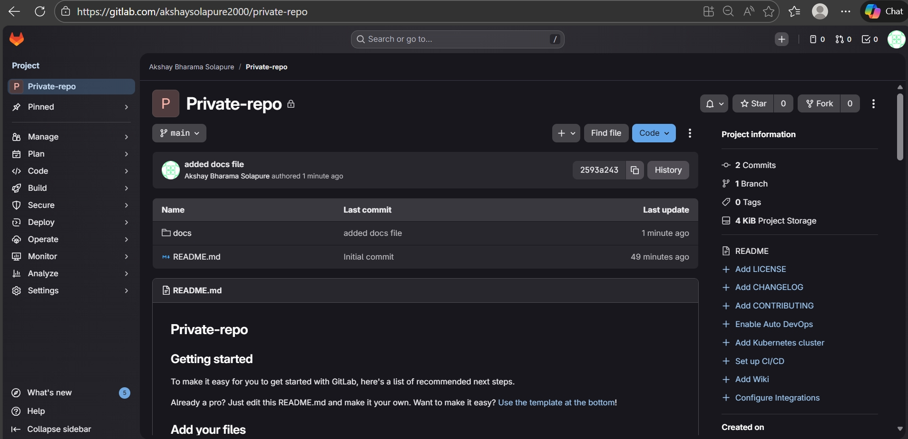
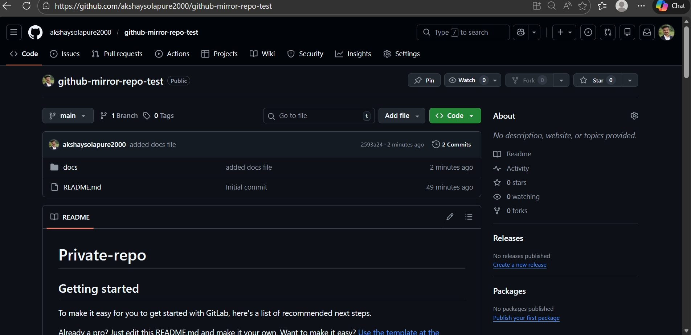

## Git and Gitlab practical assignment
### Main Task: GitHub & GitLab Collaboration & Workflow Setup
You are part of a DevOps team working on two different platforms – GitHub and GitLab. Your team wants to
ensure smooth development, proper access control,and repository mirroring between the two platforms.

#### Part 2 : GitLab Tasks
* Subtask 4: GitLab Repository Setup
1. Create a private repository on GitLab.

### 2. Clone it on your local machine using SSH (not HTTPS).

* Use Commond For Clone Private Repo To Local Machine 
* create .ssh key
~~~
git clone gitgit@gitlabcom:akshaysolapure2000/private-repo.git

ssh-keygen -t rsa 

~~~

### 3. Create a simple project structure (e.g., src/app.py , docs/guide.md).

### Create a mirror setup:
* 1. Set the GitHub private repo as the mirror of your GitLab repo.

* Add This Github Repository to the GitLab Repository

#### Create Personal Acess Token. It Required For Password Authetication 

 #### Push some changes to GitLab and verify if the changes reflect in GitHub automatically

 ~~~
 push -u oringin main
 ~~~
 

 
 